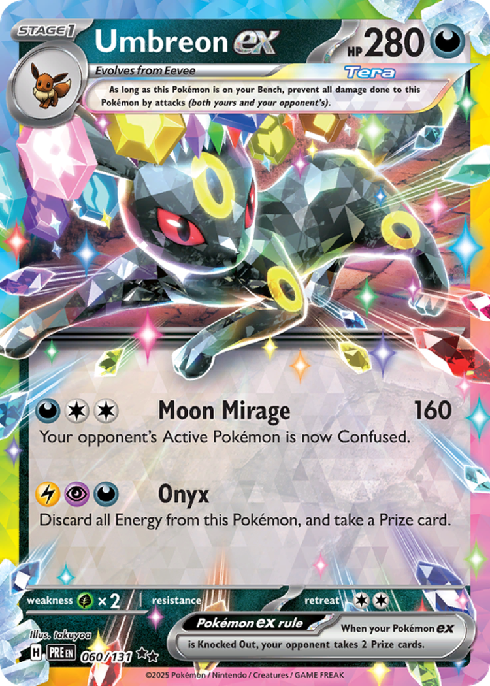
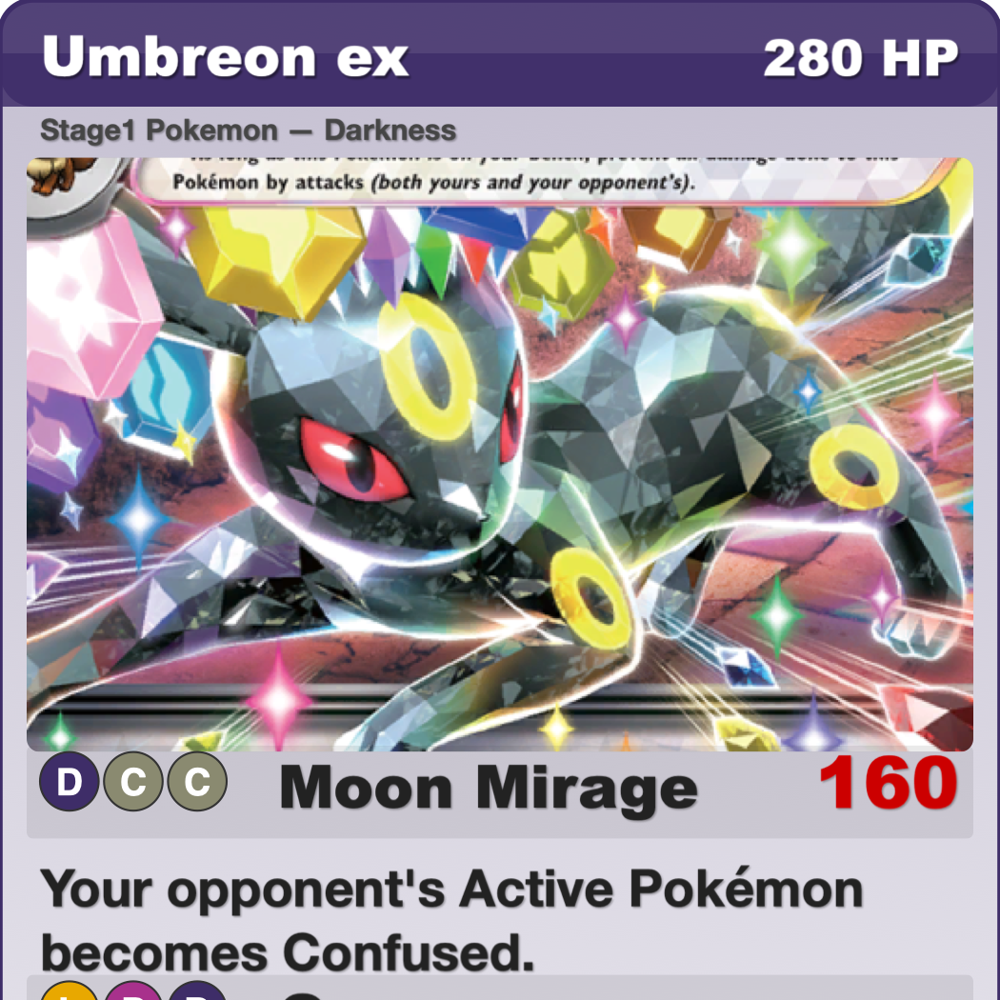
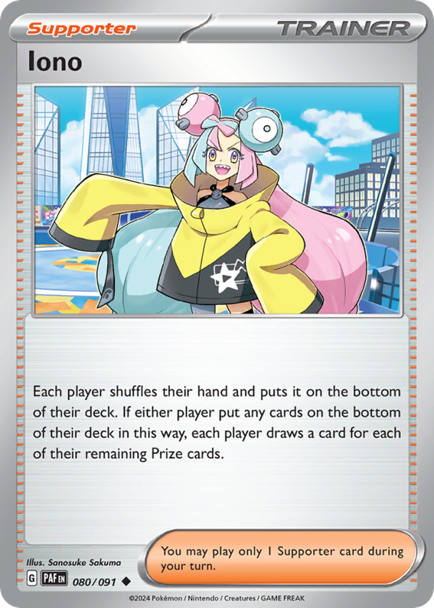
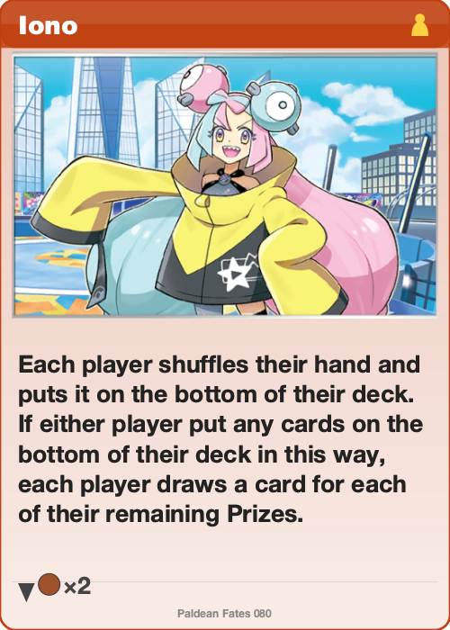
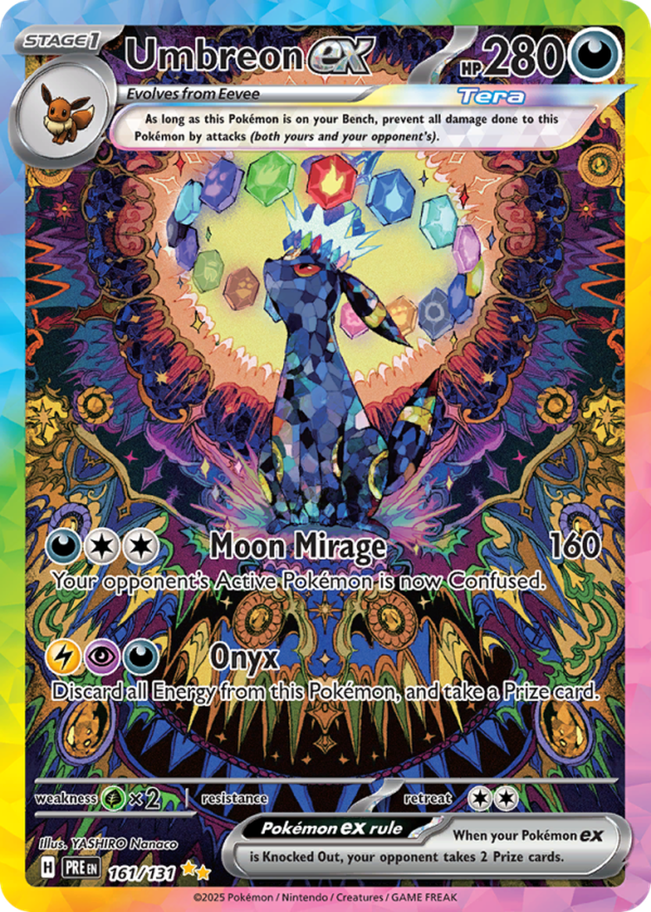
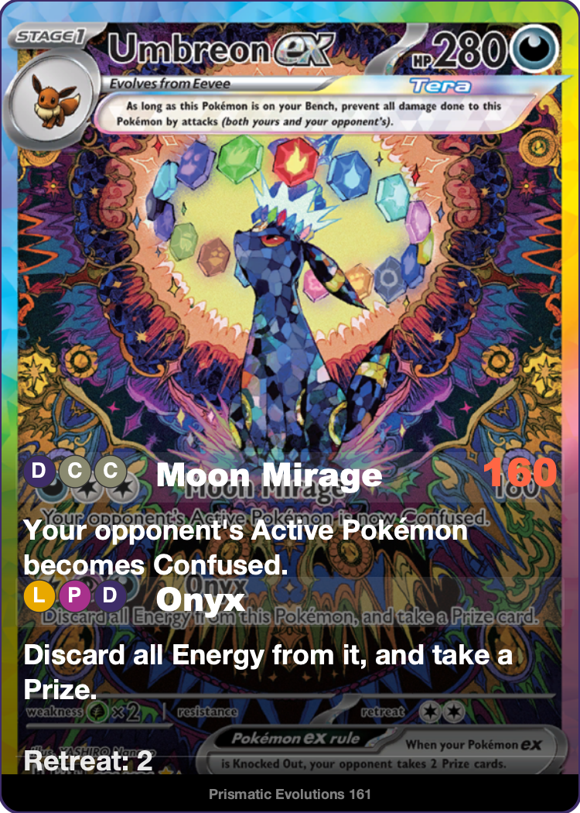
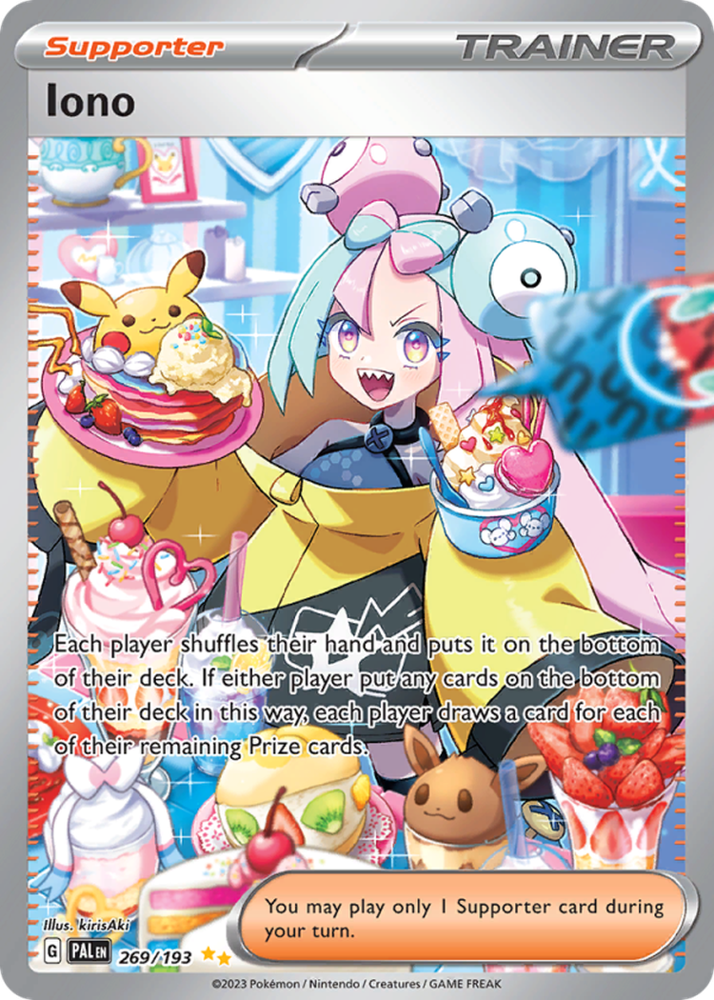
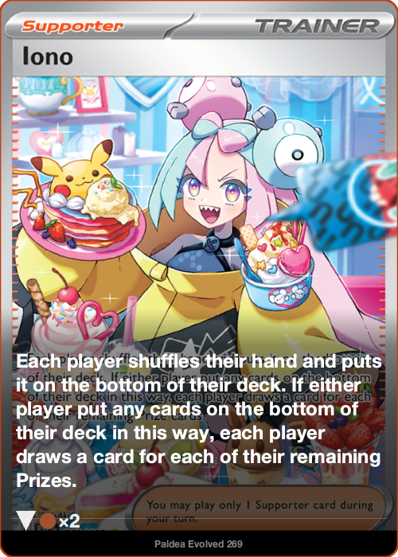

# PokeProxy

Generate printable Pokemon TCG proxy cards from a decklist. Cards are rendered as SVGs with large, readable text — designed to be sleeved in front of bulk cards for playtesting.

## Examples

### Standard Cards

<table>
<tr><th colspan="2">Umbreon ex — Pokemon</th></tr>
<tr>
<td></td>
<td></td>
</tr>
<tr><th colspan="2">Iono — Trainer / Supporter</th></tr>
<tr>
<td></td>
<td></td>
</tr>
</table>

### Full-Art Cards (Special Illustration Rare)

<table>
<tr><th colspan="2">Umbreon ex — Prismatic Evolutions</th></tr>
<tr>
<td></td>
<td></td>
</tr>
<tr><th colspan="2">Iono — Paldea Evolved</th></tr>
<tr>
<td></td>
<td></td>
</tr>
</table>

## How It Works

1. **Parse a decklist** — reads a simple text file listing set codes and card numbers
2. **Fetch card data** — pulls card metadata from the [TCGdex API](https://tcgdex.dev) and caches it locally
3. **Fetch card images** — downloads high-res card art from TCGdex and caches it
4. **Render proxy SVGs** — generates an SVG for each card with:
   - Cropped artwork from the original card
   - Large, readable text for name, HP, attacks, abilities, and effects
   - Energy cost indicators, weakness/resistance, retreat cost
   - Color-coded by Pokemon type (Grass, Fire, Water, etc.)
   - Text compression to fit verbose TCG phrasing into readable space
5. **Generate a print sheet** — produces an HTML file with cards tiled in a 3x3 grid sized for US Letter paper

### Full-Art Cards

Cards with special rarities (Illustration Rare, Special Illustration Rare, Hyper Rare, etc.) get a different treatment: the full card image is used as a background with a gradient overlay, and text is rendered on top.

### Text Compression

Attack and ability descriptions are automatically shortened using ~60 substitution rules. For example:
- "Search your deck for" → "Search deck for"
- "your opponent's Active Pokémon" → "the Defending Pokémon"
- "this Pokémon" → "it"
- "Once during your turn" → "Once a turn"
- "Knocked Out" → "KO'd"

This keeps proxy text readable without needing tiny fonts.

## Decklist Format

```
# Lines starting with # are comments
SFA 36  x3  # Okidogi ex
SFA 39  x2  # Pecharunt ex
PAF 80  x3  # Iono

# Alt format (count first):
3 SFA 36
```

Each line has a set code (e.g. `SFA`, `PAF`, `SVI`), a card number, and an optional count (`x3`). See `set_codes.py` for the full list of supported set codes (Scarlet & Violet era).

## Usage

```bash
# Default: reads decklist.txt
python pokeproxy.py

# Specify a decklist
python pokeproxy.py decklist_gallery.txt

# One copy per card (ignore counts)
python pokeproxy.py --no-dupes decklist.txt
```

### Output

- `output/*.svg` — individual proxy card SVGs
- `output/<decklist>.html` — printable sheet sized for letter paper (print at 100% scale, no margins)

### Printing

Open the HTML file in a browser and print it. Cards are 2.5" x 3.5" — standard TCG size. Sleeve them in front of bulk cards.

## Setup

```bash
python3 -m venv .venv
source .venv/bin/activate
pip install Pillow freetype-py
```

Requires macOS system fonts (Arial Black, Helvetica Neue) for text measurement via FreeType.

## Other Scripts

- **`inpaint_card.py`** — uses [LaMa](https://github.com/advimman/lama) to remove text from full-art card images (experimental). Requires `simple-lama-inpainting` and a separate `.venv-lama` environment.
- **`mflux_inpaint_test.py`** — generates masks for Flux-based inpainting of specific cards (experimental).
- **`set_codes.py`** — maps PTCGL-style set codes (e.g. `SFA`, `PAF`) to TCGdex set IDs (e.g. `sv06.5`, `sv04.5`).

## Supported Sets

All Scarlet & Violet era sets are supported, including:

| Code | Set |
|------|-----|
| SVI | Scarlet & Violet |
| PAL | Paldea Evolved |
| OBF | Obsidian Flames |
| MEW | 151 |
| PAR | Paradox Rift |
| PAF | Paldean Fates |
| TEF | Temporal Forces |
| TWM | Twilight Masquerade |
| SFA | Shrouded Fable |
| SCR | Stellar Crown |
| SSP | Surging Sparks |
| PRE | Prismatic Evolutions |
| JTG | Journey Together |
| DRI | Destined Rivals |
| WFL | White Flare |
| BBT | Black Bolt |
| SVP | SV Promo |
| SVE | SV Energy |
